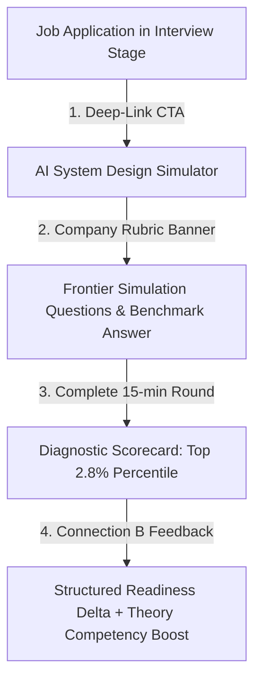

# 15. Phase 5D.1 Master Implementation Summary

## 1. Executive Summary

Phase 5D.1 successfully implemented **Connection D: Mock Interview Intelligence (Job Pipeline ➔ AI System Design Simulator)**.

---

## 2. Implemented Capabilities Inventory

| Component / Module | Purpose | Key Behavior |
| :--- | :--- | :--- |
| [`src/app/api/mock-interview/route.js`](file:///E:/career-catalyst/src/app/api/mock-interview/route.js) | Company Simulation API | Ingests `?company=...` and returns company-calibrated question sets (Anthropic, NVIDIA, OpenAI, Databricks). |
| [`src/lib/security.ts`](file:///E:/career-catalyst/src/lib/security.ts) | Security Whitelists | Added `company` and `role` to `mock_interview` whitelist fields. |
| [`src/app/job-tracker/page.js`](file:///E:/career-catalyst/src/app/job-tracker/page.js) | Pipeline Integration | Added `[ 🎙️ SIMULATE ROUND → ]` CTA in the Job Detail Preview Drawer. |
| [`src/app/mock-interview/page.js`](file:///E:/career-catalyst/src/app/mock-interview/page.js) | Contextual Simulator | Added active pipeline switcher bar, contextual simulation banner, and Connection B causal feedback wiring. |

---

## 3. Master Index of Phase 5D.1 Deliverables

All 15 documentation deliverables are committed in [`docs/phase-5d1-mock-interview-intelligence/`](file:///E:/career-catalyst/docs/phase-5d1-mock-interview-intelligence/):
1. [`docs/phase-5d1-mock-interview-intelligence/01-skill-activation-report.md`](file:///E:/career-catalyst/docs/phase-5d1-mock-interview-intelligence/01-skill-activation-report.md)
2. [`docs/phase-5d1-mock-interview-intelligence/02-connection-d-architecture.md`](file:///E:/career-catalyst/docs/phase-5d1-mock-interview-intelligence/02-connection-d-architecture.md)
3. [`docs/phase-5d1-mock-interview-intelligence/03-company-simulation-rubrics.md`](file:///E:/career-catalyst/docs/phase-5d1-mock-interview-intelligence/03-company-simulation-rubrics.md)
4. [`docs/phase-5d1-mock-interview-intelligence/04-job-tracker-integration.md`](file:///E:/career-catalyst/docs/phase-5d1-mock-interview-intelligence/04-job-tracker-integration.md)
5. [`docs/phase-5d1-mock-interview-intelligence/05-mock-interview-context-flow.md`](file:///E:/career-catalyst/docs/phase-5d1-mock-interview-intelligence/05-mock-interview-context-flow.md)
6. [`docs/phase-5d1-mock-interview-intelligence/06-simulation-completion-causal-feedback.md`](file:///E:/career-catalyst/docs/phase-5d1-mock-interview-intelligence/06-simulation-completion-causal-feedback.md)
7. [`docs/phase-5d1-mock-interview-intelligence/07-multiple-interview-handling.md`](file:///E:/career-catalyst/docs/phase-5d1-mock-interview-intelligence/07-multiple-interview-handling.md)
8. [`docs/phase-5d1-mock-interview-intelligence/08-persona-switching-verification.md`](file:///E:/career-catalyst/docs/phase-5d1-mock-interview-intelligence/08-persona-switching-verification.md)
9. [`docs/phase-5d1-mock-interview-intelligence/09-query-parameter-safety.md`](file:///E:/career-catalyst/docs/phase-5d1-mock-interview-intelligence/09-query-parameter-safety.md)
10. [`docs/phase-5d1-mock-interview-intelligence/10-accessibility-verification.md`](file:///E:/career-catalyst/docs/phase-5d1-mock-interview-intelligence/10-accessibility-verification.md)
11. [`docs/phase-5d1-mock-interview-intelligence/11-performance-and-telemetry.md`](file:///E:/career-catalyst/docs/phase-5d1-mock-interview-intelligence/11-performance-and-telemetry.md)
12. [`docs/phase-5d1-mock-interview-intelligence/12-edge-case-tests.md`](file:///E:/career-catalyst/docs/phase-5d1-mock-interview-intelligence/12-edge-case-tests.md)
13. [`docs/phase-5d1-mock-interview-intelligence/13-browser-verification.md`](file:///E:/career-catalyst/docs/phase-5d1-mock-interview-intelligence/13-browser-verification.md)
14. [`docs/phase-5d1-mock-interview-intelligence/14-regression-and-build-results.md`](file:///E:/career-catalyst/docs/phase-5d1-mock-interview-intelligence/14-regression-and-build-results.md)
15. [`docs/phase-5d1-mock-interview-intelligence/15-phase-5d1-summary.md`](file:///E:/career-catalyst/docs/phase-5d1-mock-interview-intelligence/15-phase-5d1-summary.md)
