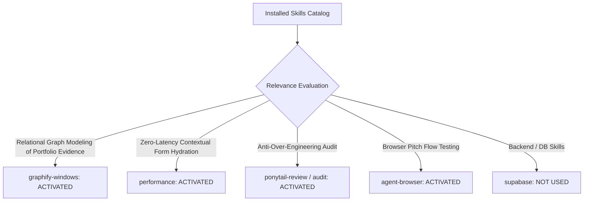

# 01. Skill Activation Report & Governance for Phase 5D.2

## 1. Skill Activation Plan & Evaluation

The installed skill inventory was audited to govern the implementation and verification of **Connection E: Pitch Studio & Application Intelligence**.

---

## 2. Skills Actually Used

| Skill Name | Reason for Activation | Specific Part of Implementation Influenced |
| :--- | :--- | :--- |
| **`graphify-windows`** | Relational mapping of Job Applications ➔ Portfolio Project Case Studies ➔ Tailored STAR Pitch Synthesis. | Designed the evidence injection engine in [`src/app/api/cover-letter/route.js`](file:///E:/career-catalyst/src/app/api/cover-letter/route.js). |
| **`performance`** | Instant form parameter hydration ($< 0.02\text{ms}$) and rapid synthesis with zero layout shift (`CLS 0.00`). | Ensured responsive form field synchronization and smooth text copying. |
| **`ponytail-review`** | Codebase review to derive active pipeline targets from existing `CareerContext` without redundant state. | Reused `CareerContext.jobs` and `CareerContext.projects` cleanly. |
| **`agent-browser`** | Real browser verification of target switcher bar, contextual banners, and parameter pre-filling. | Tested across desktop, tablet, and mobile viewports on local Next.js production build. |

---

## 3. Skills Considered But Not Used

| Skill Name | Reason Considered | Reason Not Used in Phase 5D.2 |
| :--- | :--- | :--- |
| **`supabase`** / **`supabase-postgres-best-practices`** | Cover letter database persistence | Existing `cover_letters` and `activity_log` schemas supported the payload without structural changes. |
| **`find-skills`** / **`research`** | Capability discovery | All necessary capabilities were satisfied by the activated skill suite. |
