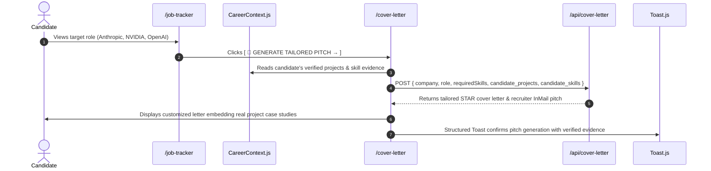

# 02. Connection E: Architecture & Flow Contract

## 1. End-to-End Architectural Flow

Connection E connects target job applications directly to the **Pitch Studio** ([`/cover-letter`](file:///E:/career-catalyst/src/app/cover-letter/page.js)):

---

## 2. Core Architectural Guarantees

1. **Deterministic Auto-Fill**: Navigating via `?company=...&role=...&skills=...` pre-populates all form inputs automatically.
2. **Real Project Injection**: Generates custom STAR paragraphs embedding the candidate's top verified case studies (e.g. *Triton Inference Gateway with 13.8ms P99 latency*).
3. **Dual Artifact Output**: Simultaneously produces a full formal STAR cover letter and a concise 120-word LinkedIn InMail recruiter outreach pitch.
