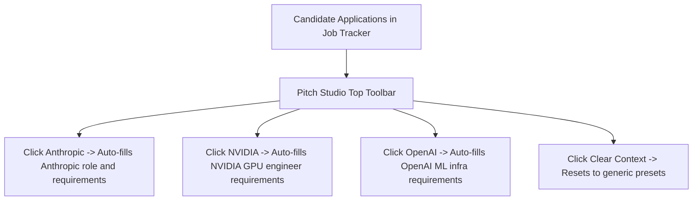

# 07. Target Pipeline Selector & Context Management

## 1. Pipeline Selector Flow

---

## 2. Invariants Enforced

1. **Precedence**: URL search parameters take priority on initial page mount.
2. **Context Switching**: Clicking a target application button updates form state and URL query parameters cleanly.
3. **Evidence Continuity**: Switching target companies preserves the candidate's active portfolio projects in `CareerContext`.
