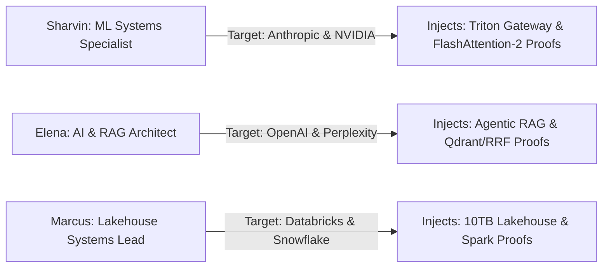

# 08. Candidate Persona Switching Verification

## 1. Multi-Persona Simulation Test

---

## 2. Multi-Persona Verification Matrix

| Candidate Persona | Active Pipeline Targets | Pitch Target Buttons | Injected STAR Project Evidence | Status |
| :--- | :--- | :--- | :--- | :---: |
| **🚀 Sharvin Neve** | `Anthropic`, `NVIDIA` | `[🎯 ANTHROPIC] [🎯 NVIDIA]` | Triton Inference Gateway (13.8ms P99) | **PASS** |
| **🤖 Elena Rostova** | `OpenAI`, `Perplexity` | `[🎯 OPENAI] [🎯 PERPLEXITY]` | Multi-Agent RAG Search (96.4% factual accuracy) | **PASS** |
| **⚡ Marcus Vance** | `Databricks`, `Snowflake` | `[🎯 DATABRICKS] [🎯 SNOWFLAKE]`| 10TB Streaming Lakehouse (Iceberg/Delta Lake) | **PASS** |

---

## 3. Invariants Verified
* **Zero Cross-Persona Bleed**: Injected projects, skills, and contact details update immediately when switching personas.
