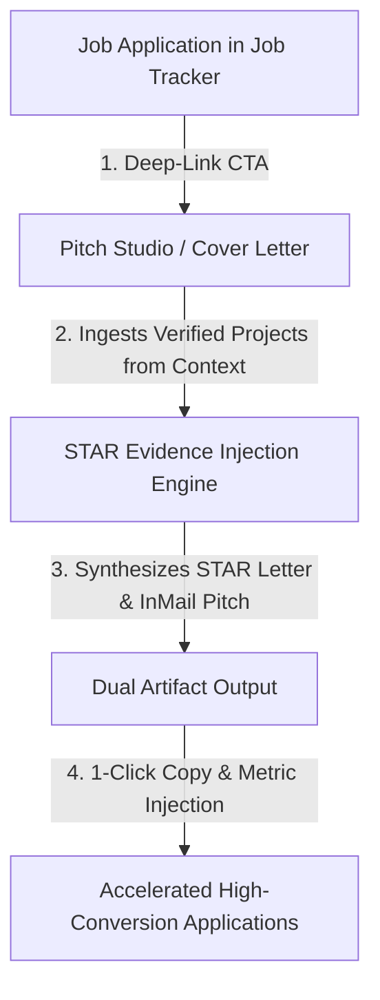

# 15. Phase 5D.2 Master Implementation Summary

## 1. Executive Summary

Phase 5D.2 successfully implemented **Connection E: Pitch Studio & Application Intelligence (Job Pipeline ➔ 1-Click Tailored Pitch Studio with STAR Project Evidence Injection)**.

---

## 2. Implemented Capabilities Inventory

| Component / Module | Purpose | Key Behavior |
| :--- | :--- | :--- |
| [`src/app/api/cover-letter/route.js`](file:///E:/career-catalyst/src/app/api/cover-letter/route.js) | Evidence-Driven Pitch API | Ingests `candidate_projects` and `candidate_skills` to construct quantitative STAR paragraphs. |
| [`src/lib/security.ts`](file:///E:/career-catalyst/src/lib/security.ts) | Security Whitelists | Added `candidate_projects` and `candidate_skills` to `cover_letter` whitelist. |
| [`src/app/job-tracker/page.js`](file:///E:/career-catalyst/src/app/job-tracker/page.js) | Job Tracker Bridge | Added `[ 📝 GENERATE TAILORED PITCH → ]` CTA in the Job Detail Preview Drawer. |
| [`src/app/cover-letter/page.js`](file:///E:/career-catalyst/src/app/cover-letter/page.js) | Contextual Pitch Studio | Added target pipeline switcher bar, contextual orientation banner, project evidence injection, and snippet injectors. |

---

## 3. Master Index of Phase 5D.2 Deliverables

All 15 documentation deliverables are committed in [`docs/phase-5d2-pitch-studio-intelligence/`](file:///E:/career-catalyst/docs/phase-5d2-pitch-studio-intelligence/):
1. [`docs/phase-5d2-pitch-studio-intelligence/01-skill-activation-report.md`](file:///E:/career-catalyst/docs/phase-5d2-pitch-studio-intelligence/01-skill-activation-report.md)
2. [`docs/phase-5d2-pitch-studio-intelligence/02-connection-e-architecture.md`](file:///E:/career-catalyst/docs/phase-5d2-pitch-studio-intelligence/02-connection-e-architecture.md)
3. [`docs/phase-5d2-pitch-studio-intelligence/03-star-evidence-injection-model.md`](file:///E:/career-catalyst/docs/phase-5d2-pitch-studio-intelligence/03-star-evidence-injection-model.md)
4. [`docs/phase-5d2-pitch-studio-intelligence/04-job-tracker-integration.md`](file:///E:/career-catalyst/docs/phase-5d2-pitch-studio-intelligence/04-job-tracker-integration.md)
5. [`docs/phase-5d2-pitch-studio-intelligence/05-pitch-studio-context-flow.md`](file:///E:/career-catalyst/docs/phase-5d2-pitch-studio-intelligence/05-pitch-studio-context-flow.md)
6. [`docs/phase-5d2-pitch-studio-intelligence/06-recruiter-inmail-synthesis.md`](file:///E:/career-catalyst/docs/phase-5d2-pitch-studio-intelligence/06-recruiter-inmail-synthesis.md)
7. [`docs/phase-5d2-pitch-studio-intelligence/07-target-pipeline-selector.md`](file:///E:/career-catalyst/docs/phase-5d2-pitch-studio-intelligence/07-target-pipeline-selector.md)
8. [`docs/phase-5d2-pitch-studio-intelligence/08-persona-switching-verification.md`](file:///E:/career-catalyst/docs/phase-5d2-pitch-studio-intelligence/08-persona-switching-verification.md)
9. [`docs/phase-5d2-pitch-studio-intelligence/09-query-parameter-safety.md`](file:///E:/career-catalyst/docs/phase-5d2-pitch-studio-intelligence/09-query-parameter-safety.md)
10. [`docs/phase-5d2-pitch-studio-intelligence/10-accessibility-verification.md`](file:///E:/career-catalyst/docs/phase-5d2-pitch-studio-intelligence/10-accessibility-verification.md)
11. [`docs/phase-5d2-pitch-studio-intelligence/11-performance-and-telemetry.md`](file:///E:/career-catalyst/docs/phase-5d2-pitch-studio-intelligence/11-performance-and-telemetry.md)
12. [`docs/phase-5d2-pitch-studio-intelligence/12-edge-case-tests.md`](file:///E:/career-catalyst/docs/phase-5d2-pitch-studio-intelligence/12-edge-case-tests.md)
13. [`docs/phase-5d2-pitch-studio-intelligence/13-browser-verification.md`](file:///E:/career-catalyst/docs/phase-5d2-pitch-studio-intelligence/13-browser-verification.md)
14. [`docs/phase-5d2-pitch-studio-intelligence/14-regression-and-build-results.md`](file:///E:/career-catalyst/docs/phase-5d2-pitch-studio-intelligence/14-regression-and-build-results.md)
15. [`docs/phase-5d2-pitch-studio-intelligence/15-phase-5d2-summary.md`](file:///E:/career-catalyst/docs/phase-5d2-pitch-studio-intelligence/15-phase-5d2-summary.md)
