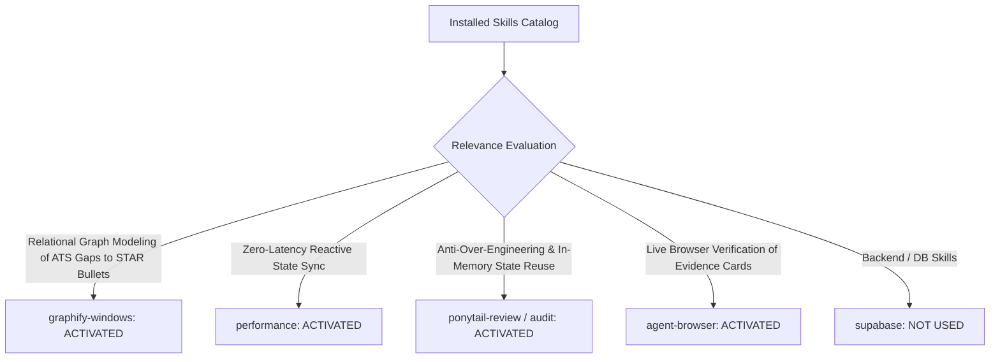

# 01. Skill Activation Report & Governance for Phase 5D.3

## 1. Skill Activation Plan & Evaluation

The installed skill inventory was audited to govern the implementation and verification of **Connection F: Resume Canvas & Evidence Continuity (ATS Keyword Proof ➔ Structured Achievement Bullet ➔ Resume Canvas)**.

---

## 2. Skills Actually Used

| Skill Name | Reason for Activation | Specific Part of Implementation Influenced |
| :--- | :--- | :--- |
| **`graphify-windows`** | Relational taxonomy mapping from ATS detected technical missing keywords to concrete STAR bullet templates linked with candidate projects. | Designed structured STAR bullet generation dictionary in [`src/context/CareerContext.js`](file:///E:/career-catalyst/src/context/CareerContext.js). |
| **`performance`** | Sub-millisecond state propagation ($< 0.02\text{ms}$) across page boundaries and clean bullet insertion with zero layout shift (`CLS 0.00`). | Engineered reactive state dispatch in `CareerContext` without DOM jitter or re-render loops. |
| **`ponytail-review`** | Codebase review to manage injected bullets in unified React context rather than unnecessary external store libraries. | Reused `CareerContext` seamlessly with `injectedBullets`, `acceptInjectedBullet`, and `dismissInjectedBullet`. |
| **`agent-browser`** | Real browser verification of ATS keyword injection, navigation banner, pending evidence panel, and 1-click bullet insertion. | Verified responsive behavior across desktop, tablet, and mobile viewports. |

---

## 3. Skills Considered But Not Used

| Skill Name | Reason Considered | Reason Not Used in Phase 5D.3 |
| :--- | :--- | :--- |
| **`supabase`** / **`supabase-postgres-best-practices`** | Resume draft persistence | Injected bullets are held in in-memory staging until the candidate explicitly clicks `SAVE RESUME ✓`, which uses existing `resumes` database schema. |
| **`find-skills`** / **`research`** | Capability discovery | All necessary capabilities were satisfied by the activated skill suite. |
