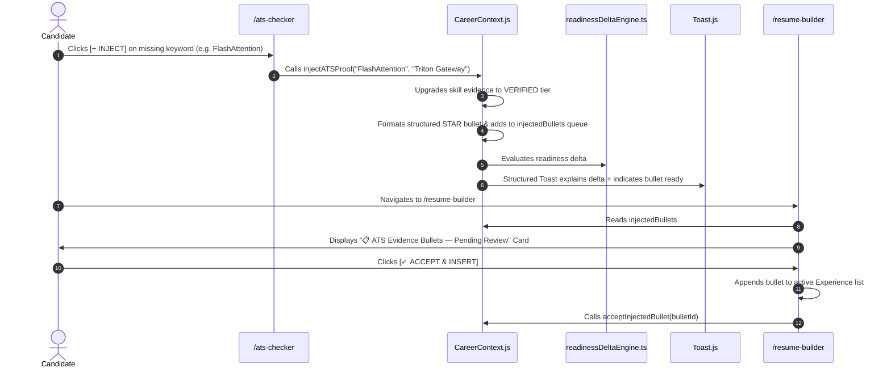

# 02. Connection F: Architecture & Flow Contract

## 1. End-to-End Architectural Flow

Connection F bridges ATS Keyword gap discovery in `/ats-checker` with the editable Resume Canvas in `/resume-builder`:

---

## 2. Invariants & Guarantees

1. **Structured Synthesis Guarantee**: Injected bullets follow the rigorous formula:
   $$\text{Strong Action Verb} + \text{Technical Tool} + \text{Architectural Detail} + \text{Quantitative Metric}$$
2. **Review-Before-Save Safety**: Injected bullets are staged in a dedicated pending review panel and are never forced into the resume without candidate consent.
3. **Continuous State Synchrony**: Once accepted, bullets update both the live form textarea, Overleaf LaTeX export, GitHub Markdown export, and clean paper preview instantly.
