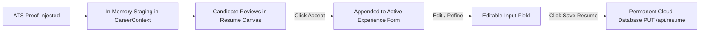

# 07. Review-Before-Commit Contract Specification

## 1. Candidate Agency & Safety Rules

1. **Explicit Review Stage**: Injected proof statements are never auto-committed to permanent database storage without user verification.
2. **Inline Editing**: Once inserted into `experienceList`, bullets become editable input fields that the candidate can adjust, shorten, or refine.
3. **Database Write Control**: The database update to `/api/resume` is triggered strictly when the user clicks the explicit `SAVE RESUME ✓` button.

