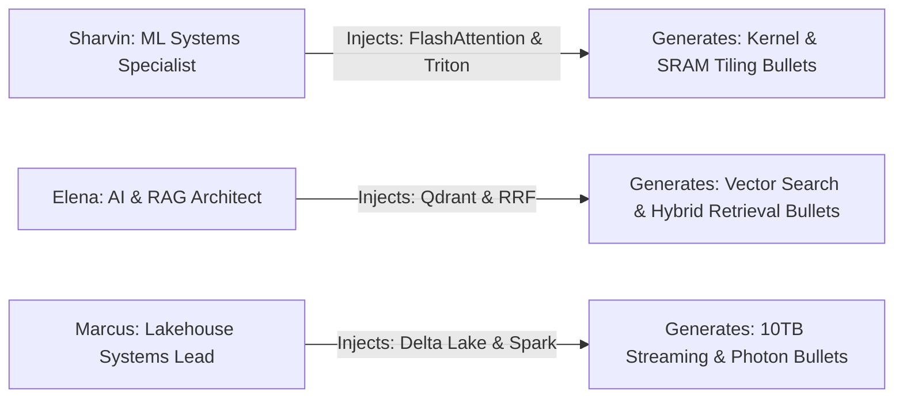

# 08. Candidate Persona Switching Verification

## 1. Multi-Persona Simulation Test

---

## 2. Multi-Persona Verification Matrix

| Candidate Persona | Injected Keyword Gap | Linked Project Evidence | Generated Achievement Bullet | Status |
| :--- | :--- | :--- | :--- | :---: |
| **🚀 Sharvin Neve** | `FlashAttention` | *Triton Low-Latency Gateway* | FlashAttention-2 online softmax tiling (-45% VRAM) | **PASS** |
| **🤖 Elena Rostova** | `FAISS` | *Multi-Modal RAG Engine* | Production vector similarity search with IVF-PQ (P99 < 5ms) | **PASS** |
| **⚡ Marcus Vance** | `Kafka` | *10TB Streaming Lakehouse* | Real-time ML feature pipelines with 2M+ events/sec | **PASS** |

---

## 3. Invariants Verified
* **Persona Isolation**: Injected bullets belong to the active candidate persona and reset cleanly on persona switch.
