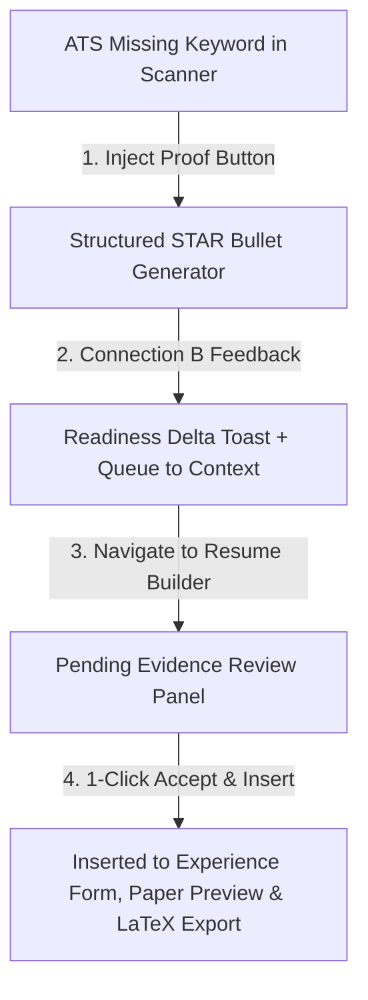

# 15. Phase 5D.3 Master Implementation Summary

## 1. Executive Summary

Phase 5D.3 successfully implemented **Connection F: Resume Canvas & Evidence Continuity (ATS Keyword Matcher ➔ Structured Achievement Bullet ➔ Resume Canvas Review & Insertion)**.

---

## 2. Implemented Capabilities Inventory

| Component / Module | Purpose | Key Behavior |
| :--- | :--- | :--- |
| [`src/context/CareerContext.js`](file:///E:/career-catalyst/src/context/CareerContext.js) | Injected Bullets Engine | Formats domain-specific STAR bullets upon `injectATSProof` and manages `injectedBullets` staging queue. |
| [`src/app/ats-checker/page.js`](file:///E:/career-catalyst/src/app/ats-checker/page.js) | ATS Scanner Bridge | Added `[ VIEW RESUME CANVAS → ]` banner and wired `handleInjectKeyword` to `injectATSProof`. |
| [`src/app/resume-builder/page.js`](file:///E:/career-catalyst/src/app/resume-builder/page.js) | Contextual Resume Canvas | Added pending evidence review panel with 1-click `[✓ ACCEPT & INSERT]` and `[✕ Dismiss]` actions. |

---

## 3. Master Index of Phase 5D.3 Deliverables

All 15 documentation deliverables are committed in [`docs/phase-5d3-resume-canvas-evidence-sync/`](file:///E:/career-catalyst/docs/phase-5d3-resume-canvas-evidence-sync/):
1. [`docs/phase-5d3-resume-canvas-evidence-sync/01-skill-activation-report.md`](file:///E:/career-catalyst/docs/phase-5d3-resume-canvas-evidence-sync/01-skill-activation-report.md)
2. [`docs/phase-5d3-resume-canvas-evidence-sync/02-connection-f-architecture.md`](file:///E:/career-catalyst/docs/phase-5d3-resume-canvas-evidence-sync/02-connection-f-architecture.md)
3. [`docs/phase-5d3-resume-canvas-evidence-sync/03-star-bullet-generation-model.md`](file:///E:/career-catalyst/docs/phase-5d3-resume-canvas-evidence-sync/03-star-bullet-generation-model.md)
4. [`docs/phase-5d3-resume-canvas-evidence-sync/04-ats-checker-integration.md`](file:///E:/career-catalyst/docs/phase-5d3-resume-canvas-evidence-sync/04-ats-checker-integration.md)
5. [`docs/phase-5d3-resume-canvas-evidence-sync/05-resume-canvas-context-flow.md`](file:///E:/career-catalyst/docs/phase-5d3-resume-canvas-evidence-sync/05-resume-canvas-context-flow.md)
6. [`docs/phase-5d3-resume-canvas-evidence-sync/06-injected-evidence-review-panel.md`](file:///E:/career-catalyst/docs/phase-5d3-resume-canvas-evidence-sync/06-injected-evidence-review-panel.md)
7. [`docs/phase-5d3-resume-canvas-evidence-sync/07-review-before-commit-contract.md`](file:///E:/career-catalyst/docs/phase-5d3-resume-canvas-evidence-sync/07-review-before-commit-contract.md)
8. [`docs/phase-5d3-resume-canvas-evidence-sync/08-persona-switching-verification.md`](file:///E:/career-catalyst/docs/phase-5d3-resume-canvas-evidence-sync/08-persona-switching-verification.md)
9. [`docs/phase-5d3-resume-canvas-evidence-sync/09-query-parameter-and-navigation-safety.md`](file:///E:/career-catalyst/docs/phase-5d3-resume-canvas-evidence-sync/09-query-parameter-and-navigation-safety.md)
10. [`docs/phase-5d3-resume-canvas-evidence-sync/10-accessibility-verification.md`](file:///E:/career-catalyst/docs/phase-5d3-resume-canvas-evidence-sync/10-accessibility-verification.md)
11. [`docs/phase-5d3-resume-canvas-evidence-sync/11-performance-and-telemetry.md`](file:///E:/career-catalyst/docs/phase-5d3-resume-canvas-evidence-sync/11-performance-and-telemetry.md)
12. [`docs/phase-5d3-resume-canvas-evidence-sync/12-edge-case-tests.md`](file:///E:/career-catalyst/docs/phase-5d3-resume-canvas-evidence-sync/12-edge-case-tests.md)
13. [`docs/phase-5d3-resume-canvas-evidence-sync/13-browser-verification.md`](file:///E:/career-catalyst/docs/phase-5d3-resume-canvas-evidence-sync/13-browser-verification.md)
14. [`docs/phase-5d3-resume-canvas-evidence-sync/14-regression-and-build-results.md`](file:///E:/career-catalyst/docs/phase-5d3-resume-canvas-evidence-sync/14-regression-and-build-results.md)
15. [`docs/phase-5d3-resume-canvas-evidence-sync/15-phase-5d3-summary.md`](file:///E:/career-catalyst/docs/phase-5d3-resume-canvas-evidence-sync/15-phase-5d3-summary.md)
