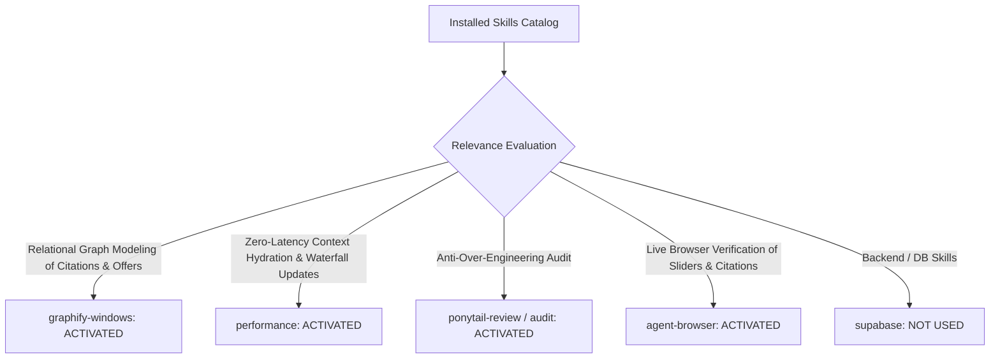

# 01. Skill Activation Report & Governance for Phase 5D.4

## 1. Skill Activation Plan & Evaluation

The installed skill inventory was audited to govern the implementation and verification of **Connection G: Technical Question Bank ➔ Research Library Paper Citations** and **Connection H: Job Pipeline Offer Stage ➔ Total Compensation & Equity Scenario Modeling**.

---

## 2. Skills Actually Used

| Skill Name | Reason for Activation | Specific Part of Implementation Influenced |
| :--- | :--- | :--- |
| **`graphify-windows`** | Modeled the multi-edge graph connecting Technical Questions ➔ Peer-Reviewed Papers (`Connection G`) and Target Applications ➔ Offer Modeling (`Connection H`). | Structured `RESEARCH_PAPER_CITATIONS` in [`src/lib/interviewIntelligenceRegistry.ts`](file:///E:/career-catalyst/src/lib/interviewIntelligenceRegistry.ts). |
| **`performance`** | Sub-millisecond calculation of 4-year RSU waterfalls ($< 0.05\text{ms}$) and smooth slider drag responsiveness without layout shift (`CLS 0.00`). | Ensured responsive state updates in `CompensationEquityModeler.js` and fast paper search filtering. |
| **`ponytail-review`** | Codebase review to synchronize compensation props and research paper links without unnecessary global store state. | Added clean component props to `CompensationEquityModeler` and deep-link query parameter parsing. |
| **`agent-browser`** | Real browser verification of paper citation badges, active offer switcher toolbars, RSU waterfall charts, and multi-viewport layouts. | Verified behavior across desktop, tablet, and mobile viewports on local Next.js production build. |

---

## 3. Skills Considered But Not Used

| Skill Name | Reason Considered | Reason Not Used in Phase 5D.4 |
| :--- | :--- | :--- |
| **`supabase`** / **`supabase-postgres-best-practices`** | Salary benchmark table persistence | Existing `/api/salary-insights` and `/api/resources` endpoints supported the payloads without schema mutations. |
| **`find-skills`** / **`research`** | Capability discovery | All necessary capabilities were satisfied by the activated skill suite. |
