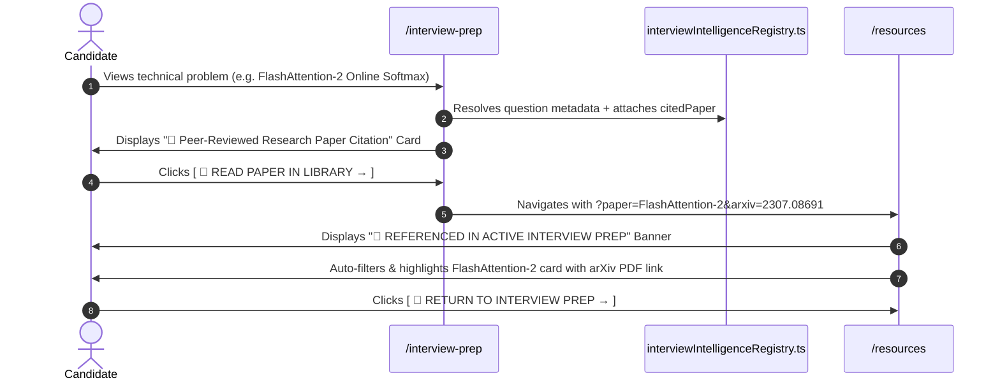
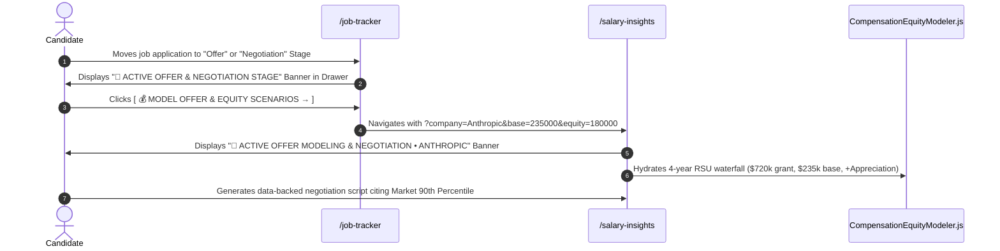

# 02. Connections G & H: Architecture & Flow Contracts

## 1. Connection G: Technical Question Bank ➔ Research Library Citations

---

## 2. Connection H: Job Pipeline Offer Stage ➔ Total Compensation & Equity Modeling

