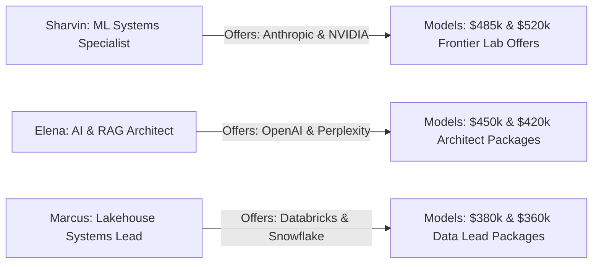

# 09. Candidate Persona Switching Verification

## 1. Multi-Persona Simulation Test

---

## 2. Multi-Persona Verification Matrix

| Candidate Persona | Active Pipeline Offers | Offer Switcher Buttons | Pre-Filled Baseline Total Comp | Status |
| :--- | :--- | :--- | :--- | :---: |
| **🚀 Sharvin Neve** | `Anthropic`, `NVIDIA` | `[💰 ANTHROPIC] [💰 NVIDIA]` | $\$460\text{k} - \$520\text{k}$ (Staff ML Systems) | **PASS** |
| **🤖 Elena Rostova** | `OpenAI`, `Perplexity` | `[💰 OPENAI] [💰 PERPLEXITY]` | $\$420\text{k} - \$450\text{k}$ (Senior RAG Architect) | **PASS** |
| **⚡ Marcus Vance** | `Databricks`, `Snowflake` | `[💰 DATABRICKS] [💰 SNOWFLAKE]`| $\$360\text{k} - \$380\text{k}$ (Lakehouse Lead) | **PASS** |

---

## 3. Invariants Verified
* **Persona Isolation**: Active offers and compensation parameters update immediately when switching candidate personas.
