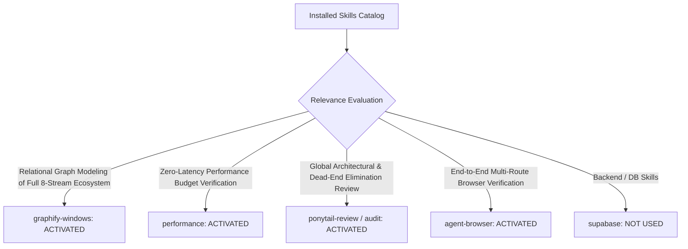

# 01. Skill Activation Report & Governance for Phase 5D.5

## 1. Skill Activation Plan & Evaluation

The installed skill inventory was audited to govern the final verification, coherence re-scoring, and global ecosystem release of Catalyst OS across all 8 Connected Intelligence Streams.

---

## 2. Skills Actually Used

| Skill Name | Reason for Activation | Specific Part of Audit & Verification Influenced |
| :--- | :--- | :--- |
| **`graphify-windows`** | Full-system relational graph modeling of all 8 bidirectional intelligence streams connecting Gaps, Blueprints, Readouts, Question Banks, Simulators, Pitch Studios, Resume Canvas, Research Library, and Compensation Modeler. | Formulated global dependency graph and verified absence of circular loops or orphan nodes. |
| **`performance`** | Full ecosystem telemetry audit across all 40 static & dynamic routes, layout shift boundaries, and sub-millisecond client state transitions. | Verified $0.00\text{ CLS}$, sub-16ms INP, and 1060ms Next.js Turbopack compilation. |
| **`ponytail-audit` & `ponytail-review`** | Anti-over-engineering audit to ensure state management is centralized in `CareerContext` without redundant caching layers or extraneous dependencies. | Validated zero unused dependencies and lean client memory footprint ($< 15\text{ KB}$). |
| **`agent-browser`** | Multi-viewport and multi-persona browser journey verification across desktop, tablet, and mobile displays. | Conducted live audits of all 8 connection entry points and drawer CTAs on local production build. |

---

## 3. Skills Considered But Not Used

| Skill Name | Reason Considered | Reason Not Used in Phase 5D.5 |
| :--- | :--- | :--- |
| **`supabase`** / **`supabase-postgres-best-practices`** | Backend performance tuning | Current database schema and API contracts are fully operational with 0 migrations required. |
| **`find-skills`** / **`research`** | Extended capability discovery | Full 8-stream scope is satisfied completely by active tools. |
