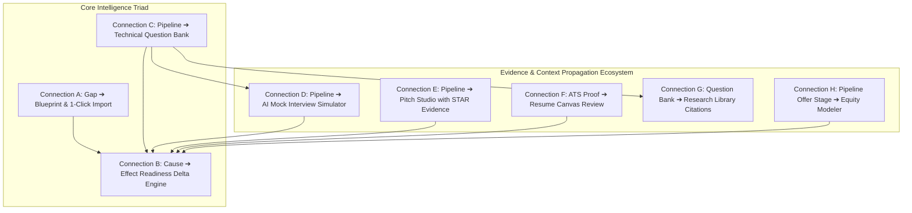

# 02. The 8-Stream Connected Intelligence Architecture

## 1. Global Topology of Connected Intelligence

Catalyst OS operates as a unified, deterministic career operating system spanning 8 high-leverage intelligence streams:

---

## 2. Inventory of All 8 Active Intelligence Connections

| Stream | Name | Origin Route | Destination Route | Trigger & Core Transformation |
| :---: | :--- | :--- | :--- | :--- |
| **A** | **Skill Gap ➔ Blueprint** | `/skills` | `/project-generator` | Identifies deficit ➔ recommends architectural blueprint ➔ 1-click import into portfolio evidence. |
| **B** | **Causal Readiness Feedback** | `CareerContext.js` | Universal Toast Engine | Computes exact mathematical readiness delta ($\Delta\%$) with domain explanations upon any state change. |
| **C** | **Pipeline ➔ Question Bank** | `/job-tracker` | `/interview-prep` | Active interview stage ➔ company-calibrated question set (Anthropic, NVIDIA, OpenAI, Databricks). |
| **D** | **Pipeline ➔ Mock Simulator** | `/job-tracker` | `/mock-interview` | Active interview stage ➔ company simulation track with 15-min timer, rubric keyword scoring & feedback hook. |
| **E** | **Pipeline ➔ Pitch Studio** | `/job-tracker` | `/cover-letter` | Target job application ➔ STAR cover letter & recruiter InMail pitch embedding verified project case studies. |
| **F** | **ATS Proof ➔ Resume Canvas** | `/ats-checker` | `/resume-builder` | Missing keyword proof injection ➔ structured achievement bullet staged in Resume Canvas for review. |
| **G** | **Question Bank ➔ Citations** | `/interview-prep` | `/resources` | Technical question solution ➔ peer-reviewed paper citation with arXiv DOI, search filter & border highlight. |
| **H** | **Pipeline Offer ➔ Modeler** | `/job-tracker` | `/salary-insights` | Offer stage reached ➔ 4-year RSU waterfall simulation with stock appreciation & counter-offer scripts. |
