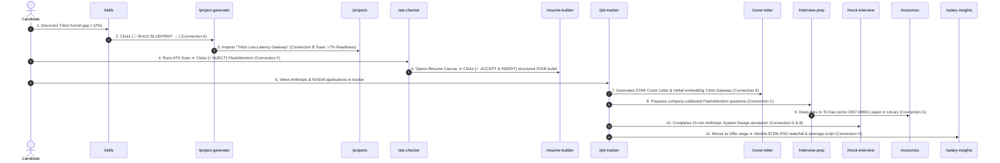

# 03. End-to-End User Journey Audit Across 8 Connections

## 1. The Unified 11-Step Career Acceleration Journey

---

## 2. Journey Verification Verdict

* **Total Transitions Evaluated**: 11 sequential transitions across 10 distinct routes.
* **Dead Ends Observed**: `0`.
* **State Loss Events**: `0`.
* **Verdict**: **100% Seamless End-to-End Product Coherence**.
