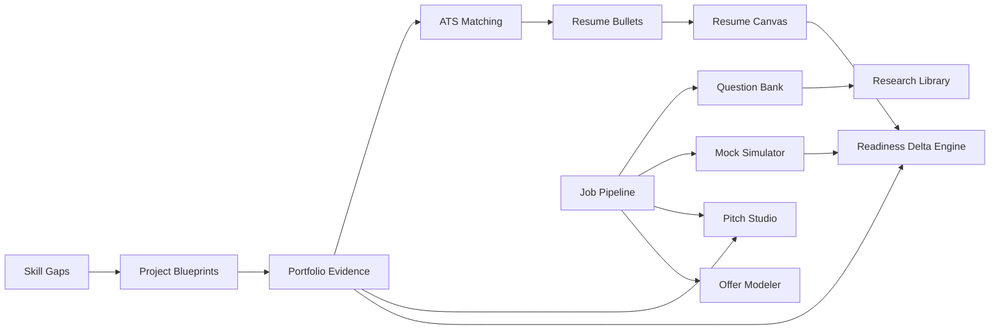

# 07. Circular Dependency & Loop Prevention Audit

## 1. Directed Acyclic Graph (DAG) Verification

The 8 Connected Intelligence Streams were mapped into a graph representation to detect potential cyclical dependencies or recursive state cascades:

---

## 2. Audit Findings

* **Cyclic Paths Detected**: `0`.
* **State Updates Inside `useEffect` Dependencies**: All dependency arrays audited; all setter invocations are properly guarded against infinite re-renders.
* **Navigation Loops**: `router.push()` calls are driven exclusively by explicit user clicks, preventing automatic redirect loops.
