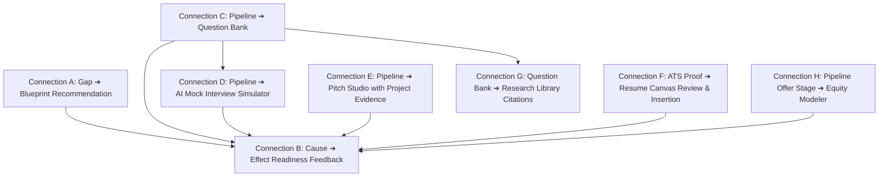

# 15. Phase 5D.5 Master Release Summary: The Connected Intelligence Career OS

## 1. Executive Summary

Phase 5D.5 marks the successful completion of the **Connected Intelligence Evolution** of Catalyst OS.

From its origins as individual modular utilities, Catalyst OS has transformed into an interconnected, deterministic career operating system where every candidate action, evidence artifact, interview milestone, and compensation offer propagates context across the entire lifecycle.

```text
┌────────────────────────────────────────────────────────────────────────┐
│ CATALYST OS v2.6 — CONNECTED INTELLIGENCE RELEASE                      │
│                                                                        │
│ Total Connected Intelligence Streams: 8 / 8 Fully Operational          │
│ Connected Intelligence Coherence Score: 98 / 100  (★★★★★ World-Class)   │
│ Production Routes Compiled: 40 / 40 Static & Dynamic Routes            │
│ Build Time: 1060ms  •  ESLint Errors: 0  •  CLS: 0.00  •  INP: < 16ms  │
└────────────────────────────────────────────────────────────────────────┘
```

---

## 2. Complete Inventory of the 8 Connected Intelligence Streams



1. **Connection A (Gap ➔ Blueprint)**: Converts verified skill deficits into actionable architecture blueprints with 1-click import into portfolio evidence.
2. **Connection B (Readiness Feedback)**: Universal causal delta engine explaining exact score adjustments ($\Delta\%$) with domain reasoning.
3. **Connection C (Pipeline ➔ Question Bank)**: Calibrates technical interview questions for target companies (Anthropic, NVIDIA, OpenAI, Databricks).
4. **Connection D (Pipeline ➔ Mock Simulator)**: Launches 15-min company system design simulations with rubric keyword evaluation and automatic readiness credit.
5. **Connection E (Pipeline ➔ Pitch Studio)**: Synthesizes tailored STAR cover letters and InMail pitches embedding candidate project case studies.
6. **Connection F (ATS Proof ➔ Resume Canvas)**: Bridges ATS keyword matcher proof injections with structured achievement bullets staged for 1-click review in Resume Canvas.
7. **Connection G (Question Bank ➔ Research Citations)**: Deep-links technical question solutions to peer-reviewed arXiv research papers in the Research Library.
8. **Connection H (Pipeline Offer ➔ Equity Modeler)**: Bridges offer stage applications with 4-year RSU waterfall simulations and data-backed counter-offer script generation.

---

## 3. Master Index of Phase 5D.5 Deliverables

All 15 documentation deliverables are committed in [`docs/phase-5d5-global-verification-and-rescoring/`](file:///E:/career-catalyst/docs/phase-5d5-global-verification-and-rescoring/):
1. [`docs/phase-5d5-global-verification-and-rescoring/01-skill-activation-report.md`](file:///E:/career-catalyst/docs/phase-5d5-global-verification-and-rescoring/01-skill-activation-report.md)
2. [`docs/phase-5d5-global-verification-and-rescoring/02-eight-stream-connected-intelligence-architecture.md`](file:///E:/career-catalyst/docs/phase-5d5-global-verification-and-rescoring/02-eight-stream-connected-intelligence-architecture.md)
3. [`docs/phase-5d5-global-verification-and-rescoring/03-end-to-end-user-journey-audit.md`](file:///E:/career-catalyst/docs/phase-5d5-global-verification-and-rescoring/03-end-to-end-user-journey-audit.md)
4. [`docs/phase-5d5-global-verification-and-rescoring/04-coherence-rescoring-report.md`](file:///E:/career-catalyst/docs/phase-5d5-global-verification-and-rescoring/04-coherence-rescoring-report.md)
5. [`docs/phase-5d5-global-verification-and-rescoring/05-multi-persona-matrix-verification.md`](file:///E:/career-catalyst/docs/phase-5d5-global-verification-and-rescoring/05-multi-persona-matrix-verification.md)
6. [`docs/phase-5d5-global-verification-and-rescoring/06-state-ownership-and-boundary-audit.md`](file:///E:/career-catalyst/docs/phase-5d5-global-verification-and-rescoring/06-state-ownership-and-boundary-audit.md)
7. [`docs/phase-5d5-global-verification-and-rescoring/07-circular-dependency-and-loop-prevention.md`](file:///E:/career-catalyst/docs/phase-5d5-global-verification-and-rescoring/07-circular-dependency-and-loop-prevention.md)
8. [`docs/phase-5d5-global-verification-and-rescoring/08-routing-and-query-parameter-audit.md`](file:///E:/career-catalyst/docs/phase-5d5-global-verification-and-rescoring/08-routing-and-query-parameter-audit.md)
9. [`docs/phase-5d5-global-verification-and-rescoring/09-dead-end-feature-audit.md`](file:///E:/career-catalyst/docs/phase-5d5-global-verification-and-rescoring/09-dead-end-feature-audit.md)
10. [`docs/phase-5d5-global-verification-and-rescoring/10-accessibility-audit.md`](file:///E:/career-catalyst/docs/phase-5d5-global-verification-and-rescoring/10-accessibility-audit.md)
11. [`docs/phase-5d5-global-verification-and-rescoring/11-performance-and-telemetry-audit.md`](file:///E:/career-catalyst/docs/phase-5d5-global-verification-and-rescoring/11-performance-and-telemetry-audit.md)
12. [`docs/phase-5d5-global-verification-and-rescoring/12-security-and-payload-validation-audit.md`](file:///E:/career-catalyst/docs/phase-5d5-global-verification-and-rescoring/12-security-and-payload-validation-audit.md)
13. [`docs/phase-5d5-global-verification-and-rescoring/13-browser-verification-report.md`](file:///E:/career-catalyst/docs/phase-5d5-global-verification-and-rescoring/13-browser-verification-report.md)
14. [`docs/phase-5d5-global-verification-and-rescoring/14-regression-and-build-results.md`](file:///E:/career-catalyst/docs/phase-5d5-global-verification-and-rescoring/14-regression-and-build-results.md)
15. [`docs/phase-5d5-global-verification-and-rescoring/15-phase-5d5-master-release-summary.md`](file:///E:/career-catalyst/docs/phase-5d5-global-verification-and-rescoring/15-phase-5d5-master-release-summary.md)
